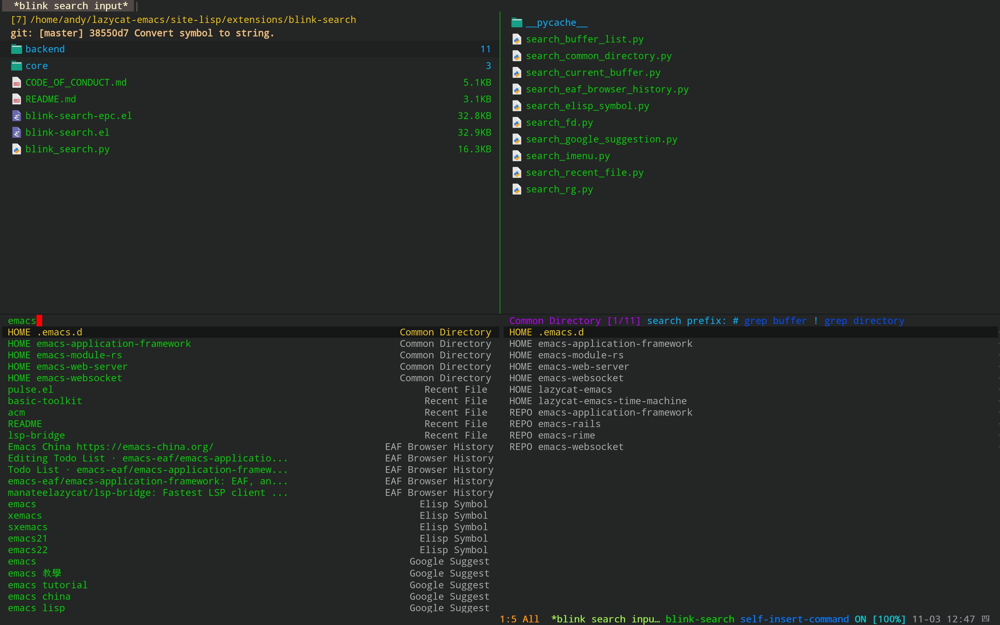
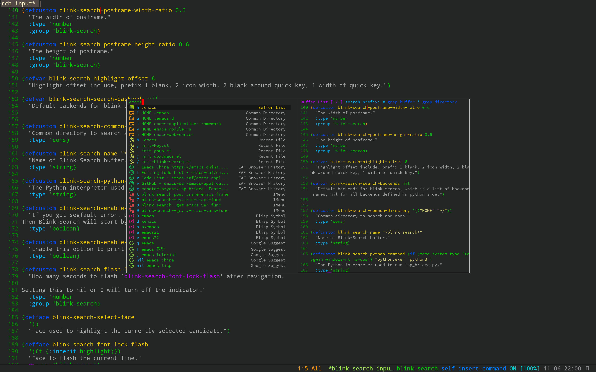
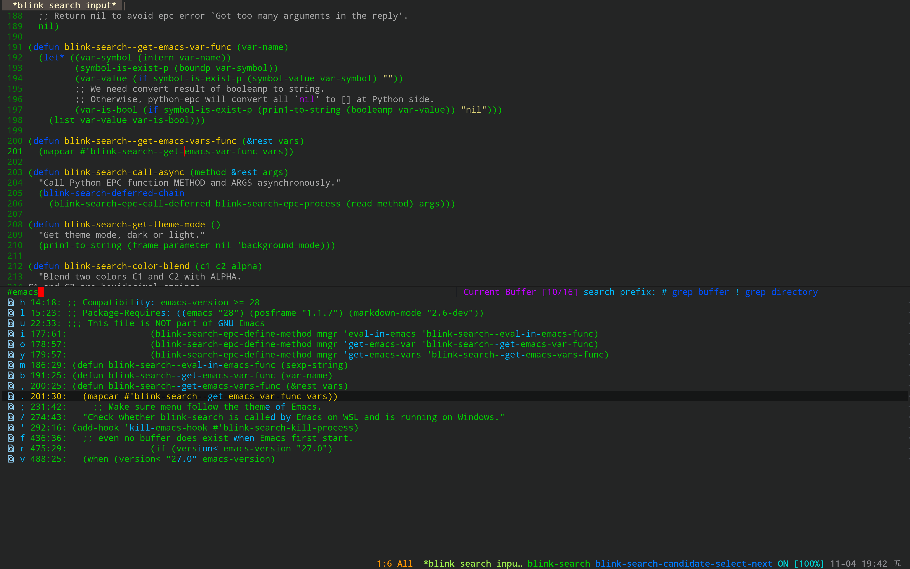
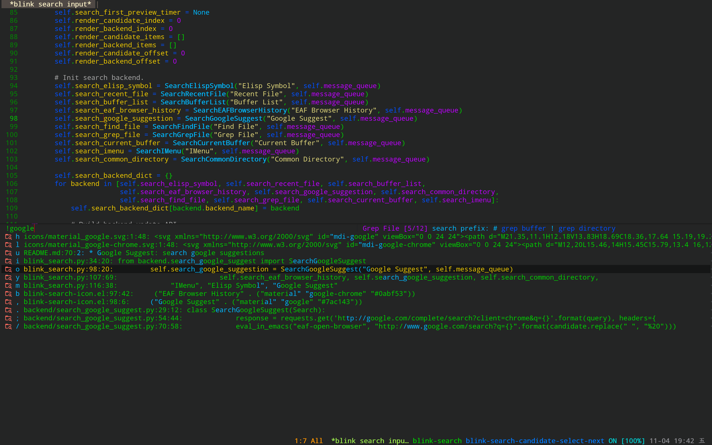

# blink-search

<p align="center">
  <br><strong>In the blink of an eye, the search is complete!</strong>
</p>

<br>

blink-search is the fastest multi-source search framework for Emacs.

It uses Python's threading technology to search candidates and offloads all the computation to external Python process, hence, the Emacs session itself stays always responsive, as it has very few things to do, such as, render candidates of visible area.

blink-search will provide smooth completion experience without compromise to slow down emacs' performance.

<p align="center">
  <br>Show search results in split window
</p>


<p align="center">
  <br>Show search results in popup window
</p>


## Installation

1. Install Emacs 28 and above versions
2. Install Python dependencies: `pip3 install epc requests`
3. Install external tools: 
+ [fd](https://github.com/sharkdp/fd)
+ [ripgrep](https://github.com/BurntSushi/ripgrep)
+ [sqlite3](https://www.sqlite.org) (optional, for sqlite3 backend)
+ [rga](https://github.com/phiresky/ripgrep-all) (optional, for searching pdf backend)
4. Clone or download this repository (path of the folder is the `<path-to-blink-search>` used below).
5. Add following code in your ~/.emacs:

```elisp
(add-to-list 'load-path "<path-to-blink-search>")

(require 'blink-search)
```

## Usage
1. Start blink-search: M-x blink-search
2. C-u M-x `blink-search` to search current symbol
3. Typed keyword to search from all backends
4. Search current buffer when keyword starts with `#`
5. Search current directory when keyword starts with `!`
6. Press `Ctrl + m` to select candidate or press `Alt + QuickKey` to select candidate match QuickKey

| Grep Buffer                                          | Grep Directory |
| :--------:                                       | :----:                                                      |
|  |  |

## Keymap
| Key      | Command                   | Description                                                                  |
| :---     | :---                      | :---                                                                         |
| C + n    | blink-search-candidate-select-next           | Select next candidate item                                                        |
| C + p  | blink-search-candidate-select-prev           | Select previous candidate item                                                    |
| M + n    | blink-search-backend-select-next           | Select next backend item                                                        |
| M + p  | blink-search-backend-select-prev           | Select previous backend item                                                    |
| M + j    | blink-search-candidate-group-select-next           | Select next candidate group item                                                        |
| M + k  | blink-search-candidate-group-select-prev           | Select previous candidate group item                                                    |
| C + j  | blink-search-parent           | Jump to parent directory of select candidate item                                                    |
| C + l  | blink-search-continue           | Continue search new directory of current candidate item                                                    |
| C + m  | blink-search-do           | Execute action for selected candidate item                                                    |
| C + M + m  | blink-search-preview           | Preview selected candidate item                                                    |
| C + M + n  | blink-search-preview-next           | Preview next candidate item                                                    |
| C + M + p  | blink-search-preview-next           | Preview previous candidate item                                                    |
| M + w  | blink-search-copy           | Copy text of selected candidate item                                                    |
| C + g  | blink-search-quit           | Quit 

* `blink-search-restart-process`: restart blink-search process (only used for development)

## Option
* `blink-search-search-backends`: default backends for blink search, which is a list of backend names, nil for all backends defined in python side. For example, blink-search only search result from buffer-list and find-file backend when set this option to `("Buffer List" "Find File")`
* `blink-search-enable-posframe`: set this option with `t`, blink-search render search results by popup window, this feature need you install [posframe](https://github.com/tumashu/posframe) first
* `blink-search-browser-function`: the default browser used for google suggestion. The default is `eaf-open-browser`, you can set it to `xwidget-webkit-browse-url` if your emacs is built with xwidget module. Or `browse-url-default-macosx-browser/browse-url-xdg-open` to open the browser by your system default browser.
* `blink-search-common-directory`: Common directory to search and open, default is `'(("HOME" "~/"))`
* `blink-search-grep-pdf-search-paths`: Paths to search for pdf files.
* `blink-search-grep-pdf-backend`: Backend to use for pdf files, default is `'pdf-tools`, set to `'eaf-pdf-viewer` if you prefer to use EAF pdf viewer.

## Search Backend

blink-search has completed the following search backends:

* History: search history of execute action
* Buffer List: search buffer list
* Common Directory: search your favorite common directories, you can customize option `blink-search-common-directory`
* Recent File: search recent files
* Current Buffer: use `ripgrep` grep content of current buffer
* Grep File: use `ripgrep` grep files under git project or current directory
* IMenu: search variable/function of current buffer that base on imenu
* Find File: use `fd` search files under git project or current directory
* EAF Browser: search history of EAF browser
* Elisp Symbol: search elisp symbol
* Google Suggest: search google suggestions and open in browser
* Key Value: read/get/del/update key-value pairs in sqlite3, require `sqlite3` and ensure `pip install sqlite3` at first
* Grep PDF: use `rga` search pdf files in several directories with `blink-search-grep-pdf-search-paths` 
* PDF: use `rga` search current pdf file

## Report bug

Please use `emacs -q` and load a minimal setup with only blink-search to verify that the bug is reproducible. If `emacs -q` works fine, probably something is wrong with your Emacs config.

If the problem still exists, please report it [here](https://github.com/manateelazycat/blink-search/issues/new) with `*blink-search*` buffer content, it contains many clues that can help us locate the problem faster.

If you get a segfault error, please use the following way to collect crash information:

1. Install gdb and turn on option `blink-search-enable-debug`
2. Use the command `blink-search-stop-process` to stop the current process
3. Restart blink-search, send issue with `*blink-search*` buffer content when next crash

## Contributor

<a href = "https://github.com/manateelazycat/blink-search/graphs/contributors">
  
</a>
